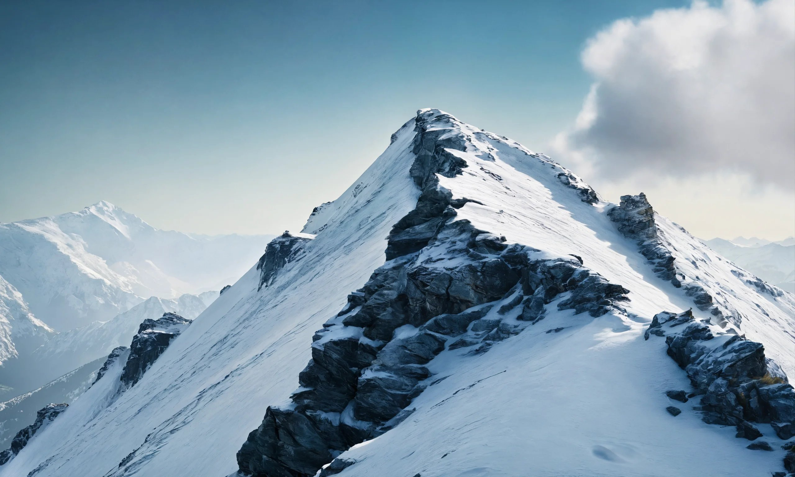
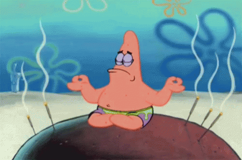

<!-- {:style="width: 100%; max-width: 100%; margin-left: 0%"} -->

Welcome :) This is a little experiment in sharing a few things I've been writing lately.

The name is meant to evoke the image of holding opposite ideas together: of walking along a mountain-ridge, or a tight-rope, or a river-bridge... Marveling at both sides with wide eyes, and just hanging there, refusing to fall. It was inspired by a [mathematical idea](https://arxiv.org/pdf/2011.06505), and springs from a desire to push back against an overly polarised world. To find commonality, and a shared sense of purpose, even as -- *especially when* -- we disagree.
<!-- To tread lightly along the Middle Way. -->
<!-- To tread along the [Middle Way](https://en.wikipedia.org/wiki/Middle_Way); to be in harmony with the natural balance between opposites. -->

Which is not to say we are to become liquid, lukewarm, evergreen. Quite the contrary. The goal is to find nuance, to sustain the complexity of the world, where different sights call for different pairs of glasses. A wise woman is not without conviction -- but she is eagle-spirited and compassionate enough to see through opponents' eyes. To keep a keen heart for civilised debate. It is a beautiful moment when we feel that our mind has contracted around an idea, and suddenly lets go. It allows us to build bridges towards others' islands.

<!-- {:style="width: 100%; max-width: 115%; margin-left: 0%"} -->

I hope this will be a place to keep track of my attempts (and failures) to ride such 'ridges'. But it would make no sense to do this alone. My dream would be for the blog to become a conversation -- and I would love to receive your messages, opinions, feedback, criticism, questions, answers. So feel free to leave comments below blog posts, or reach out to me directly here: <ridingtheridge@protonmail.com>. It would mean the world.
<!-- In the near future I will setup a newsletter where we can keep this conversation going, on a weekly rhythm. -->
<!-- I hope this experiment will be useful to someone, somewhere. The purpose of life, I think, is to *bloom*, and I wish nothing less for you. -->

<!-- - **[Essays](../essays)**. Random "essays" about anything and everything. Take light-heartedly.
- **[Poems](../poems)**. I'm no poet, but I love to write just the same, and hope some of them will mean something to you. Some are strongly related to the idea of holding opposites together; others not. Some will be in my mother-tongue, French; hopefully others will be in English.
<!-- - **[Dancing](../dancing)**. Sometimes I like to dance. I usually start with a sensation, or a feeling, or a part of the body I am trying to listen to better, and see where it takes me. Sometimes people ask me to share these little dances with them. I don't have Instagram, and I'm all against the 2D flatness of it, but sometimes it's good to let go and just share things you enjoy doing with others. -->

<!-- {:style="width: 120%; max-width: 120%; margin-left: -10%"} -->
<!-- *Blooming Patrick.* -->

**Thank-yous.** This website is adapted from a template designed by the talented [Artem Sheludko](https://github.com/artemsheludko/reked), powered by [Jekyll](https://jekyllrb.com/), and hosted by [Github Pages](https://pages.github.com/). The pictures on this website are either my own, or were generated using [Lexica Aperture](https://lexica.art/) or [Bing Image Creator](https://www.bing.com/images/create), which are free to use for non-commercial purposes.
